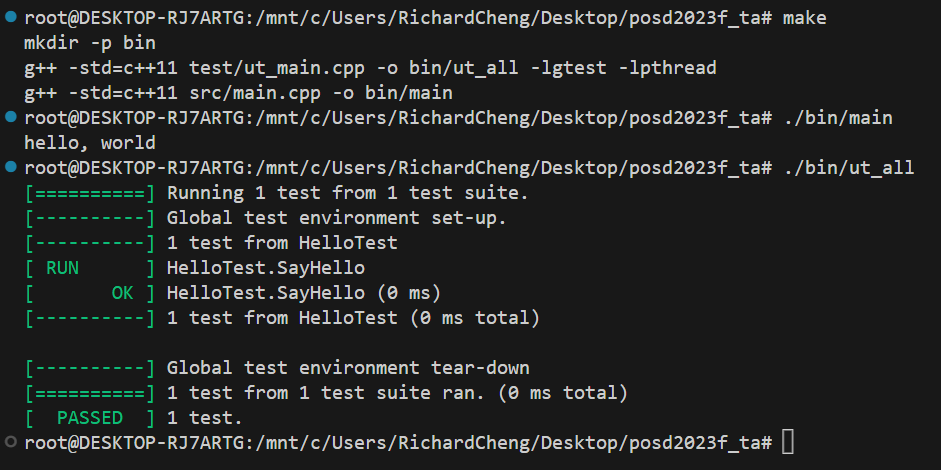

# POSD with C++ (and more)

#### FALL, 2023

#### Prof Y C Cheng

#### Dept of Computer Science and Information Engineering

#### Taipei Tech

### Important Links

* [Gitlab](http://140.124.181.100): http://140.124.181.100

* [Jenkins](http://140.124.181.97:8080): http://140.124.181.97:8080

## Assignment 0

### Due: 2023/09/18 23:59

### Purpose of this assignment

In this assignment, you should complete the development environment setting and setup GitLab project for hand in the assignment. In addition, you need to complete and hand in a helloworld project to make sure your setting is completed.

### Environment and repository setup

**Follow the following steps to setup your environment**

- [Environment Setup](./setup_tutorial/computer_environment_setting.md)
- [GitLab Setup](./setup_tutorial/gitlab_setup.md)
- [Steps for hand in assignments](./setup_tutorial/hand_in_assignment_steps.md)
- [Jenkins setup](./setup_tutorial/jenkins_setup.md)

### Upload same code to your assignment

In this assignment, you need to download the [sample code](http://140.124.181.100/course/posd2023f_ta/-/archive/hw0/posd2023f_ta-hw0.zip?path=sample_code) and copy all the contents to your own repository. There is a function `std::string sayHello(std::string)`in **src/hello.h** file. The command `make` generates two executable files: "bin/ut_all" and "bin/main". The following screenshot shows the expected output of both files:

**score:**
- Upload successfully (100%)

***Note:***
- **\_TA project** will be used in this homework.
