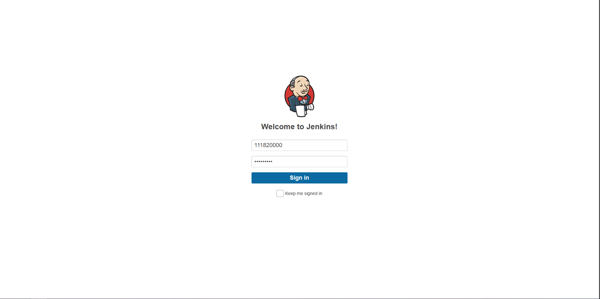
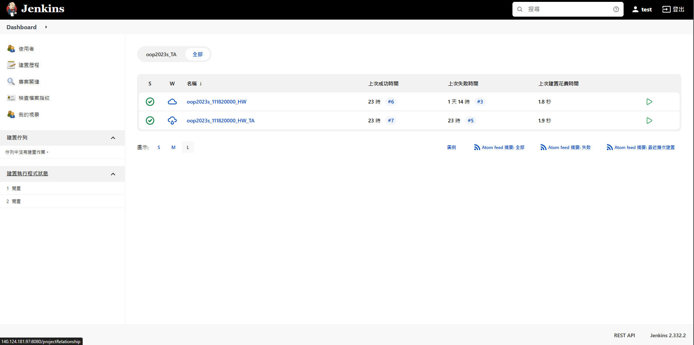
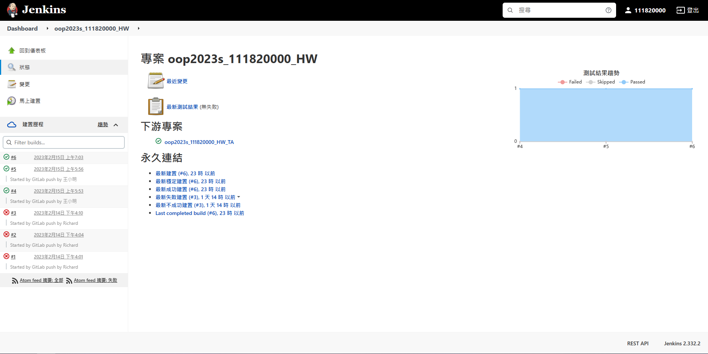
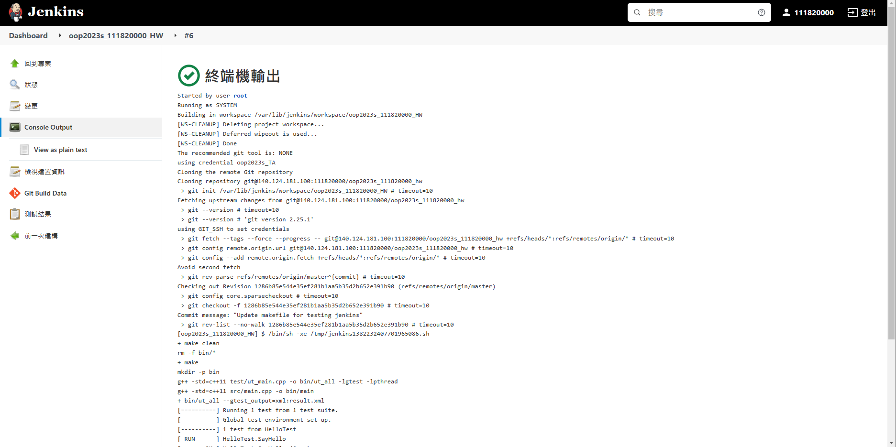

# __Jenkins Tutorial

## 登入 Jenkins

- URL: http://140.124.181.97:8080/login?from=%2F
- Account: Student ID
- Password: Student ID (Default)
  
\* Please change your password after first login. To reset your password, you click the username on top right and select "Setting".

## Assignment Jobs

Each student gets two jobs in Jenkins: posd2023f\_\${STUDENT\_ID}\_HW and posd2023f\_\${STUDENT\_ID}\_HW\_TA. Once you push changes to your GitLab repository, posd2023f\_\${STUDENT\_ID}\_HW is triggered to compile your code and run the tests you wrote. If posd2023f\_\${STUDENT\_ID}\_HW built successfully, posd2023f\_\${STUDENT\_ID}\_HW\_TA will start to run the test from TA to test your code.

A green check mark means the build succeeded, and a red cross mark means the build failed. 

## Check console

To get more information about the building result, you can enter the job and select the bulid number on the left to check the console output. This is useful when a build failure occurred.

## Scoring

To get full score, you need to make the job posd2023f\_\${STUDENT\_ID}\_HW\_TA passed. Before due date, there is no limit times for updating your code. Please start early and try hard fixed code for passing the tests from TA.

